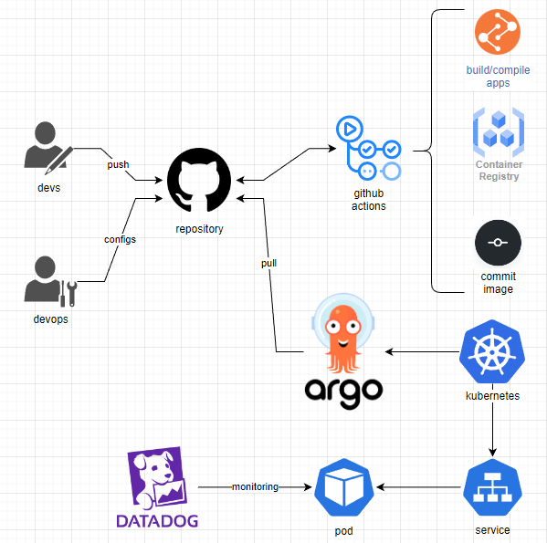

# Workflow


## Requirements
* GitHub Personal Token

### Local
* Docker
* Make

### Kubernetes
* kubectl
* Helm
* ArgoCD

## Usage

Build application
```bash
make build
```

Run application
```bash
make run
```

Reconfigure
```bash
make release
```

Deploy Argo Applications
```bash
make k8s-dev
make k8s-main
```

Running up on kubernetes
```bash
make up
```

Clean
```bash
make clean
```